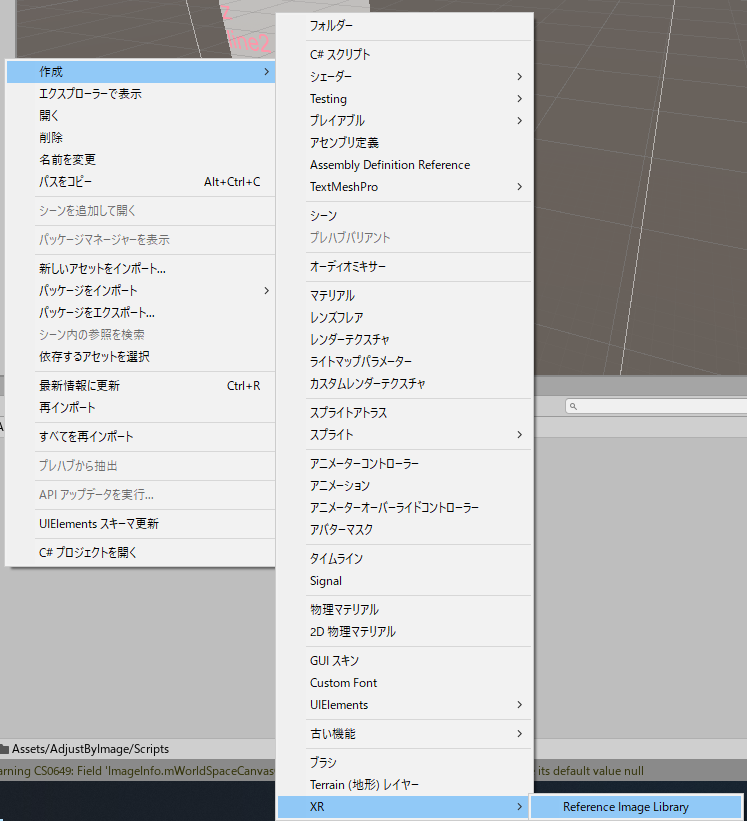
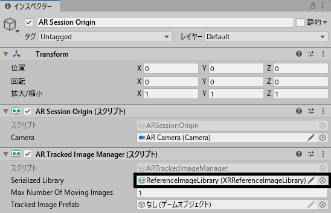
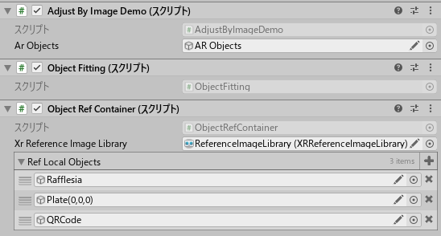

# Adjust By Image

## これ何?

ARFoundationのImageTrackingを利用して、事前登録した現実の物体に、仮想のオブジェクトを位置合わせするためのライブラリ

ARFoundationでネストした子オブジェクトの位置合わせを、親オブジェクトを動かすことで実現することが面倒だったので  
(座標計算とクオータニオンの計算が面倒だったんです)

## 依存パッケージ

* ARFoundation 3.0.1 or later
* Text Mesh Pro(Demoで使用) 2.0.1 or later

## 利用方法

### Image Tracking出来るようになるまで

1. 依存パッケージをインポートする
2. ReleaseページにあるUnity Packageをインポートする
3. ARSessionOriginを作成し、ARTrackingImageManagerをアタッチする
4. ReferenceImageLibraryを作成し、使いたい写真をセットする

5. ARTrackingImageManagerにReferenceImageLibraryをセットする

### AdjustByImageを使えるようにする

具体的なコード例は、Examples / AdjustByImageDemo / AdjustByImageDemo.cs参照

1. Scripts / ObjectFitting.csをシーン内にアタッチする
1. ObjectFitting.csをアタッチしたゲームオブジェクトに
 Scripts / PositionIdentifiable / IPositionIdentifiable.csを継承したスクリプトをアタッチする
 (おすすめはScripts / PositionIdentifiable / PositionContainer / ObjectRefContainer.cs)
1. IPositionIdentifiable.csを継承したスクリプトで、追跡した画像と、ゲームオブジェクトの紐づけを行う
1. イベントハンドラーARTrackedImageManager.trackedImagesChangedを使用して、アクティブなARTrackedImageを取得し、ObjectFitting.MoveArObjectsを呼ぶ

## API

### ObjectFitting

子オブジェクト特定のためにIArObjectIdentifiableを継承したスクリプトと同じゲームオブジェクトにアタッチする必要があります。

* GameObject: 位置合わせしたいオブジェクトの親オブジェクト
* ARTrackedImage: 位置合わせしたい画像

#### void AlignObjectsParallel(GameObject, ARTrackedImage)

ARTrackedImagesChangedEventArgs eventArgs.addedを対象にしたメソッド

ARTrackedImageを初めて認識したフレームで位置合わせを行っても、うまく位置が合わないため、50ms待ってから位置合わせを行うタスクを生成する。

#### void AlignObjectsLowFrequency(GameObject, ARTrackedImage)

ARTrackedImagesChangedEventArgs eventArgs.updatedを対象にしたメソッド

ARTrackedImageと任意のオブジェクトの角度と位置をGameObjectを動かすことで合わせる

#### AlignObjectsHighFrequency(GameObject, ARTrackedImage, float, bool)

ARTrackedImagesChangedEventArgs eventArgs.updatedを対象にしたメソッド

ARTrackedImageと任意のオブジェクトの角度と位置をGameObjectを動かすことで合わせる
高頻度で呼ぶ際に、カクつかないよう、線形補完を行う

### IArObjectIdentifiable

ARTrackedImageとオブジェクトの対応付けをするためのメソッドを実装することを保証するインターフェース
このインターフェースを実装していれば、自作クラスでも問題ないです。

#### (bool, Vector3, Quaternion) GetLocalPositionByName(string)

* bool: GetLocalPositionByNameの成否
* Vector3: 写真に対応付けられたオブジェクトのローカルポジション
* Quaternion: 写真に対応付けられたオブジェクトのローカルローテーション
* string: 写真の名前

写真の名前をもとに、写真に対応したARオブジェクトのローカル座標とクォータニオンを返すメソッド

### ObjectRefContainer

おそらくIArObjectIdentifiableを継承したクラスの中で、一番使い勝手が良いであろうクラス。

インスペクターでセットするXRReferenceImageLibraryと、インスペクターでセットするGameObjectでDictionaryを作る。
